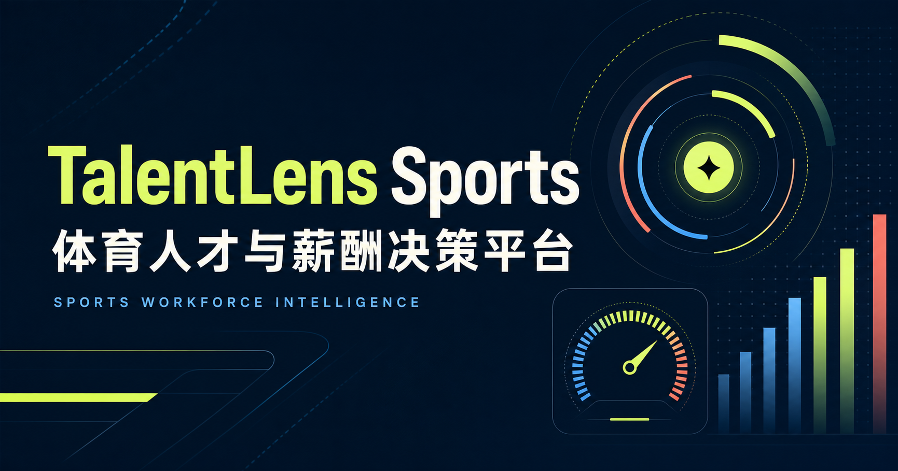

# TalentLens Sports｜行业人才与薪酬决策平台



一个面向体育公司的 HR 数据解决方案作品集项目。平台以虚构的“跃界体育集团”为案例，把人才供需、岗位解析、薪酬洞察与编制测算串成一条可交互的管理决策链路。

> 项目定位：用于展示 HR 咨询思维、数据产品能力和负责任的 AI 应用。所有公司、岗位、人才及薪酬数据均为模拟数据，不代表真实企业，也不应作为个人求职或谈薪依据。

## 在线体验

仓库上传 GitHub 后，可按下方“本地运行”启动。当前版本不需要账号、数据库或 API Key。

## 业务问题

当体育公司从传统赛事运营转向数字运动服务时，管理团队需要同时回答四个问题：

- 增长所需的关键人才是否充足？
- 哪些城市更适合布局不同类型的团队？
- 关键岗位应该采用怎样的薪酬市场定位？
- 在预算约束下，编制和城市组合如何取舍？

## 核心模块

| 模块 | 解决的问题 | 主要输出 |
| --- | --- | --- |
| 经营总览 | 人才投入是否支持业务增长 | 人才就绪度、成本、风险信号 |
| 人才地图 | 人才在哪里、哪些技能最稀缺 | 城市人才指数、供需矩阵、招聘策略 |
| AI 岗位解析 | 如何把非结构化 JD 变成统一口径 | 标准岗位、技能标签、资格要求、诊断建议 |
| 薪酬洞察 | 薪酬是否具有竞争力与内部公平性 | P25/P50/P75、Compa-ratio、差异化定位 |
| 编制模拟 | 不同方案的成本与组织风险是什么 | 编制、城市组合、市场分位与预算测算 |
| AI 决策助手 | 如何把分析结果转成管理建议 | 带依据、权衡和限制说明的建议 |

## 可交互内容

- 按城市筛选人才供需与薪酬市场信息
- 输入职位描述并生成结构化岗位诊断
- 调整人数、薪酬分位与城市组合，实时测算年度成本
- 向本地 AI 演示助手提问，获得带证据与限制说明的建议
- 使用浏览器打印功能导出决策摘要

## AI 与数据边界

- 当前岗位解析器和决策助手使用本地规则与模拟知识库，未连接外部大模型。
- 成本、分位数和预算由确定性公式计算，不由语言模型生成。
- 不对候选人或员工做自动化评分，不使用年龄、性别等敏感属性。
- 招聘报价、模拟薪酬调查和内部薪酬数据在界面中明确区分。
- 正式业务使用前，必须接入经过授权的数据并完成人工复核与效果验证。

详细的数据定义见 [数据字典](docs/DATA_DICTIONARY.md)，项目方法与岗位能力映射见 [项目说明](docs/PROJECT_BRIEF.md)。

## 技术栈

- React 19 + TypeScript
- Vinext + Vite
- 原生 CSS 响应式布局
- Node.js 内置测试框架
- Cloudflare Worker 兼容构建

## 本地运行

环境要求：Node.js 22.13 或更高版本、pnpm 11。

```bash
pnpm install
pnpm run dev
```

浏览器访问 `http://localhost:3000`。

## 验证

```bash
pnpm run build
pnpm test
```

## 项目结构

```text
app/                    页面、交互逻辑与样式
docs/                   项目说明与数据字典
public/                 品牌图形与分享封面
tests/                  构建产物基础测试
worker/                 Cloudflare Worker 入口
.openai/hosting.json    Sites 托管配置
```

## 后续路线

- 接入经过授权的真实职位与薪酬数据
- 引入大模型 API、检索增强生成与结构化输出校验
- 建立人工标注验证集，报告准确率、召回率和拒答率
- 增加方案保存、版本对比与咨询报告导出
- 增加登录、权限控制与敏感字段审计
